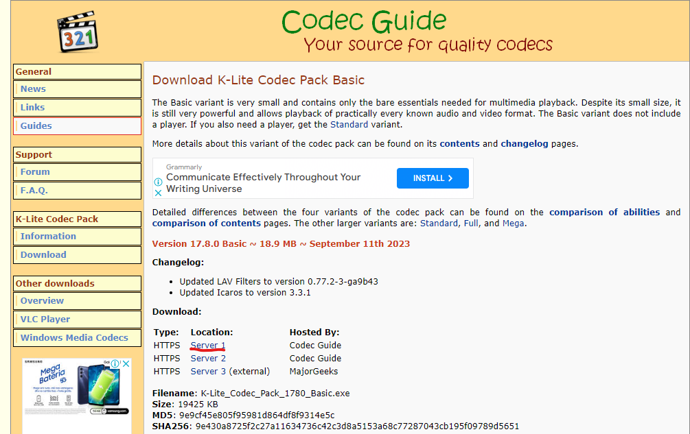
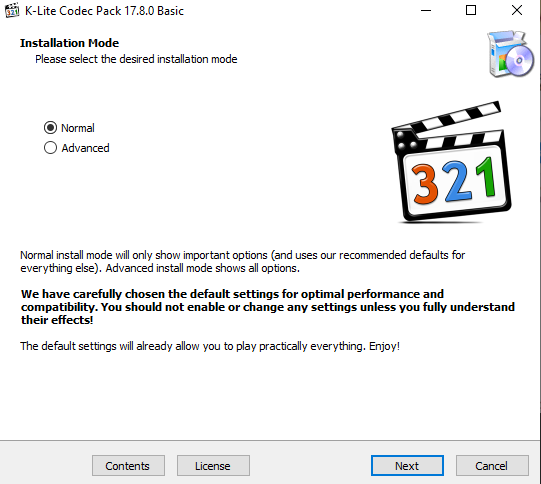
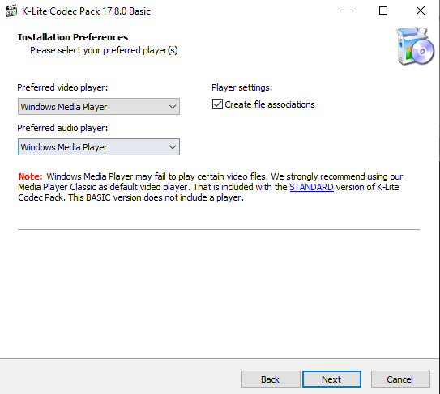
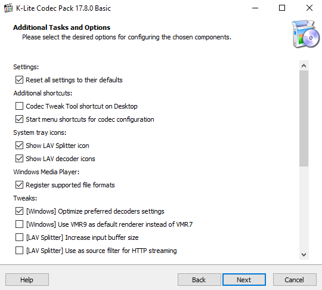
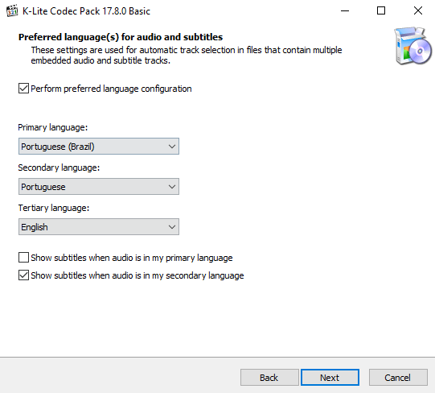
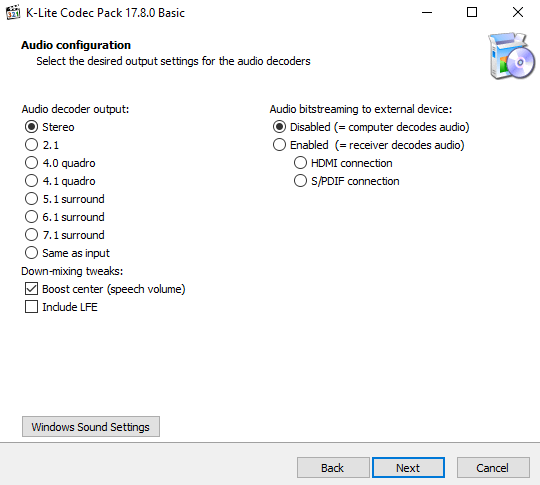
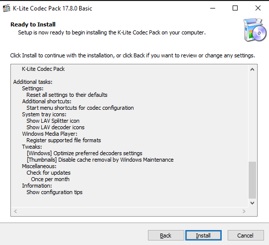

### Download
1. Acesse o link: https://codecguide.com/download_k-lite_codec_pack_basic.htm   
2. Clique em "Server 1" conforme imagem  
     
3. Aguarde até o final do download.  

### Instalação
1. Execute o Instalador.  
2. Clique em "Next"  
     
3. Mantenha as duas opções em "Windows Media Player"  
     
4. Clique em "Next", não é necessário alterar nenhuma configuração.  
     
5. Clique em "Next", novamente, não é necessário alterar nenhuma configuração.  
     
6.  Clique em "Next", não é necessário alterar nenhuma configuração.  
     
7.  Clique em "Next", não é necessário alterar nenhuma configuração.  
     
8. Clique em "Next", não é necessário alterar nenhuma configuração.  
     
9. Basta clicar em "Finish"  

